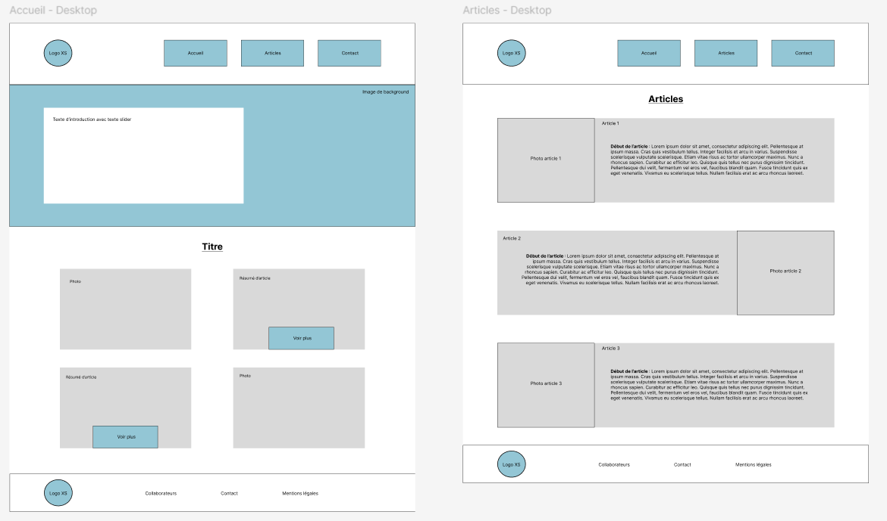
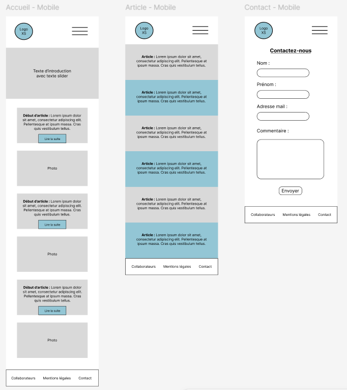
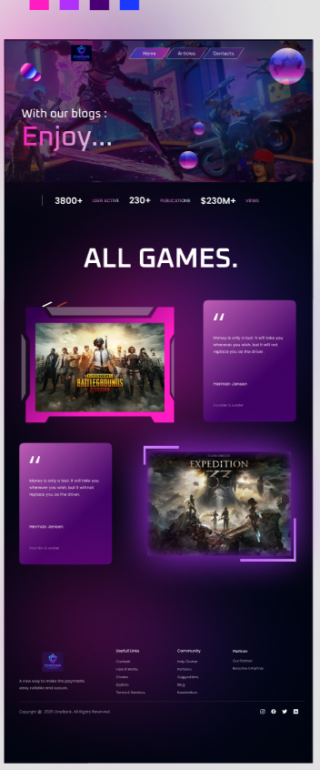
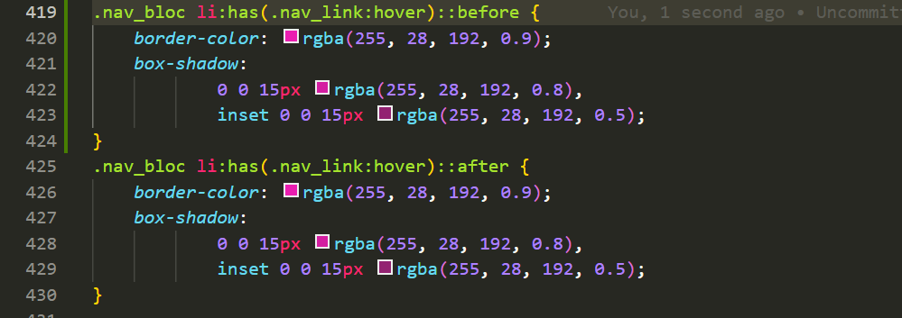
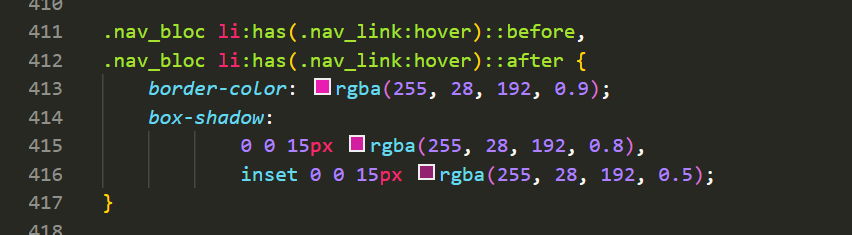
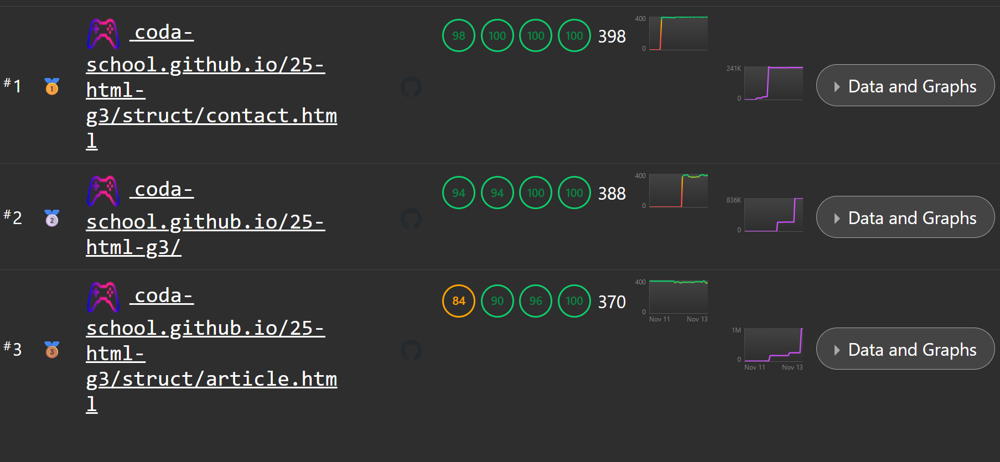

# Journal de projet

<!-- 
Notez tout ce qui est utile au fur et à mesure de votre progression sur le projet.

Ex. les questions que vous vous posez.
Les réponses que vous trouvez après avoir galéré un moment.

Ce qui a été fait, ce qu'il reste à faire.

Des photos ou copies de vos prototypes.

Des exmples de code.

-->

## Lundi 10 novembre

Le groupe est composé de
- Ethan
- Clémence 
- Darill
- Hugo M

Un sujet que nous avons proposé : Un BLOG DE JEUX VIDEOS - 'Chedar Blogame'

Voici les fonctionnalités principales attendues :

- Navigation entre les différentes pages
- Burger menu sur vue téléphone 
- Adapté à tous les écrans
- Formulaire de contact
- Mode bilingue 
- Eco index 
- Mode sombre

Ce qui a été fait aujourd'hui :

Ethan : Rédaction des différents articles.

Hugo M : Participation à la rédaction des articles et réalisation du journal. 

Darill : Constitution des ressources image adaptées aux différents formats (mobile, tablette, desktop), choix des polices : Obitron et Space - Grotesk 

Clémence : Réalisation du wireframe du site : , .

## Mardi 11 novembre

• Jour 2: du projet (Décision Technique de l'équipe sur l'édition d'un maquette de haute fidélité) :: L'équipe a souhaité faire une maquette pour avoir une base plus concrète d'aspect visuel avant de passer au code...
  
(DARILL)   
Au vu du temps restant et de la possible complexité de sa mise en oeuvre nous avons abandonné cette idée de départ même si les couleurs utilisées ainsi que l'aspect général ont bien été exploités pour rester conforme à notre charte graphique...

## Mercredi 12 novembre

• Grâce aux cours dispensés pendant le projet, nous avons procédé à quelques modifications de notre code CSS notemment au niveau de la gestion des appels aux propriétés ciblées :  
   
AVANT...
   
APRES... On obtient un code beaucoup moins long et plus compréhensible.

•Les problèmes ! En effet, nous avons été confrontés à plusieurs problèmes avec Git. Nous avions plusieurs branches à notre nom pour que chacun puisse travailler sur sa partie sans que les autres doivent pull constamment, évitant donc les conflits. Nous aurions alors fusionné les différentes branches sur une branche annexe, puis après vérification sur la main, malheureusement ce ne peut se faire.
Certains ne pouvaient pas pull les branches correctement et se supprimer instantanément, plusieurs conflits ont aussi eu lieu car les différentes branches ne pouvaient être récupérées et donc un conflit avait lieu. En bref, nous avons fini par mettre sur la main petit à petit.

## Jeudi 13 Novembre

•Peaufinage du code et vérification des erreurs :
Un problème trouvé et réglé dans le CSS

Nous avons vérifier les exigences en groupe pour rendre compte sur le respect ou non des exigences. 

-Eco index : A+ 
-Résultat CSS et HTML : Pas d'erreur
-spedlify :images/

•Une mise à niveau de chacun sur le code en commun a été réalisée.

## PETIT RESUME SUR NOTIONS APPRISES...

- La superbe notion de mobile first : 

Le Mobile First est une façon d'écrire du code web que j'ai trouvé très interéssante. Le principe est assez simple :
L'on commence par coder le site en prenant en compte l'affichage de la page en format mobile (320px en l'occurence) 
en partant du principe que cette largeur est la plus minimale possible même parmi les petits terminaux. Ensuite il
faut bien sûr adapté progressivement l'affichage aux formats des plus grands terminaux. 

Pour commencer l'on est d'accord pour dire que cette façon de faire n'est pas habituelle, enfin 'habituelle' pour
dire que l'on commence souvent par observer l'aspect du site correspondant aux paramètres de taille de notre 
terminal et seulement ensuite on s'adapte aux plus petits terminaux.

Le déclic que j'ai eu sur ce projet est celui de dire : "En réalité la majorité des sites qu'un développeur produit
sont consultés depuis les petits terminaux". Et oui, l'on ne code pas pour soi même mais plutôt pour le grand
public et donc l'on doit penser d'abord à "que verront la majorité des utilisateurs ?". En réalité, ce que l'on
fait quand on commence par visualiser le site selon nous et après selon les autres terminaux s'assimile plus à du bricolage... 

En résumé, j'adhère désormais à la pratique du mobile first qui permet d'aller plus vite et d'avoir un meilleur
rendu général de l'apparence de notre site.

- Les notions d'animations (@keyframes) : 

Cette notion est l'une des plus belles que j'ai découverte. Pour la partager correctement je souhaite que vous vous
imaginiez une sorte de maître d'orchestre qui en face de son orchestre décide à quel moment il doit y avoir
une telle ou telle variation musicale ou une telle ou telle pause...

@keyframes est notre chef d'orchestre. Un chef d'orchestre très talentueux qui avec précision réussi à dire à nos éléments HTML ciblés dans notre CSS comment se comporter précisement à un moment 't' de l'ensemble de la partition 
à jouer. Cette partition se joue sur une durée et donc il nous permet de définir les états succesifs tout au long de notre animation... un élément tout simplement fascinant et pourtant je sais, pour avoir lu la doc qu'il est beaucoup plus puissant et poyvalent que l'utilisation que j'en ai faite....

- Les notions de pseudo classes notemment ::before ::after :

Cette notion est aussi l'une de mes préférées acquises pendant ce projet. Elle permettent de faire énormément de
choses car elles agissent comme des jumelles superposées de chaque élément. On peut l'utiliser pour faire des choses
assez folles comme ajouter du contenu sur un élément sans agir directement sur celui ci. Un exemple palpable est celui des boutons de style très gaming qui ont une sorte de bords en 'L' au niveau des coins du boutons. Pour le faire il suffit donc d'utiliser le before, de le mettre en absolute, et de le placer en top -2px et en left -2px (les valeurs négatives font en sorte que l'on voit les bords dépasser) et ensuite on y ajoute une bordure bien épaisse pour qu'elle soit visible.